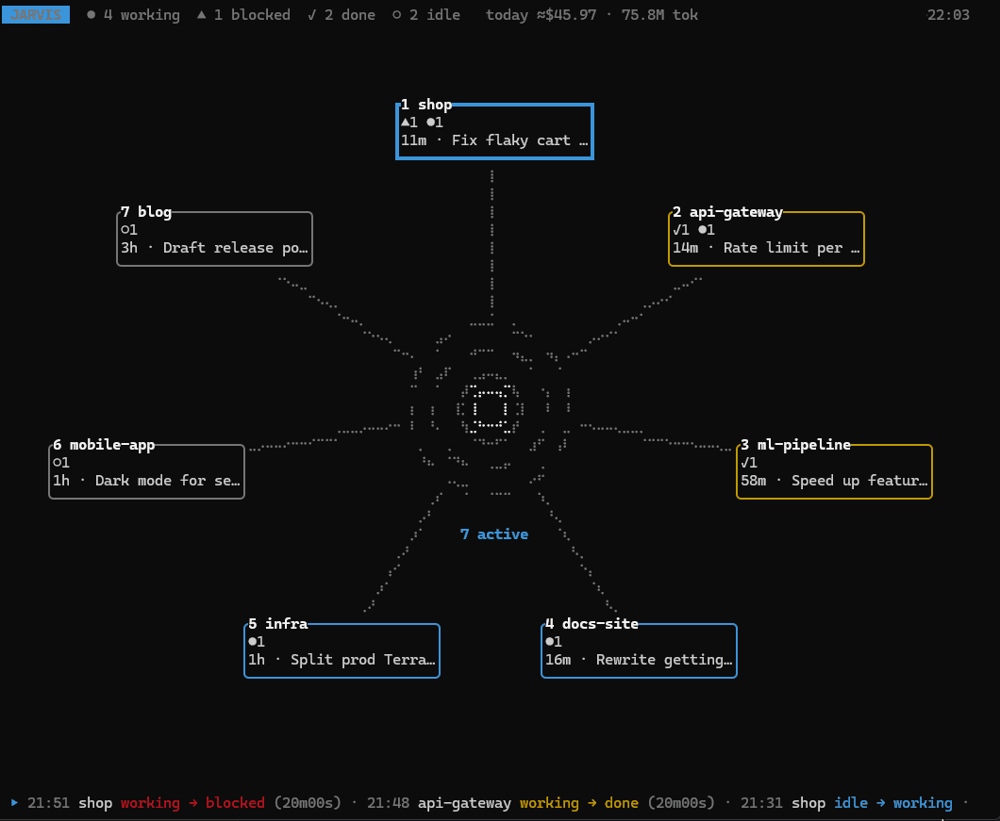
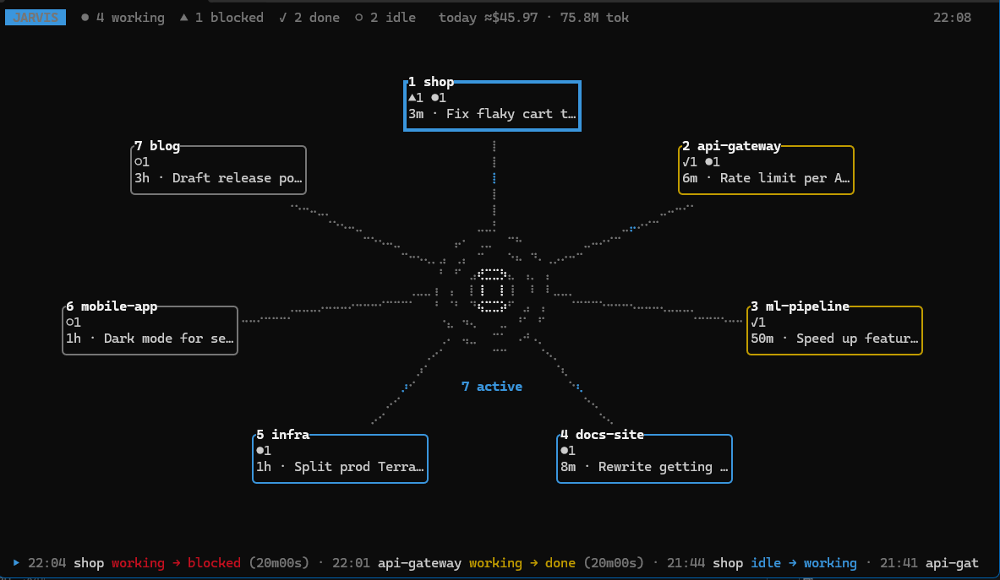

# Jarvis

[](https://github.com/NexorPL/herdr-jarvis/actions/workflows/ci.yml)
[](https://github.com/NexorPL/herdr-jarvis/releases/latest)
[](LICENSE)
[](https://herdr.dev)
[](https://rustup.rs)


**Mission control for [herdr](https://herdr.dev).** One keypress opens Jarvis in its own tab, and it stays
open while you work. Its animated core: every project with herdr activity branches out of it, showing which agents are working,
which are done and which are blocked on you. Drill into a project for its agents, Claude Code threads,
event timeline and token cost.



Linux, macOS and Windows. herdr 0.9.0+.

## Install

```bash
herdr plugin install NexorPL/herdr-jarvis
```

The install step downloads a prebuilt, SHA-256-verified binary for your platform and falls back to
`cargo build --release` (Rust from https://rustup.rs) when none matches.

## Run

From any shell inside herdr:

```bash
herdr plugin action invoke jarvis.open
```

Jarvis opens in its own tab and stays open; `q` closes it. herdr does not list plugin actions in its
menus, so for everyday use bind a key in herdr's `config.toml` and reload it (global menu →
`reload config`). If Jarvis is already open, the same key jumps to its tab instead of starting a second
one:

```toml
[[keys.command]]
key = "ctrl+alt+j"  # prefix+j is taken: it moves to the pane below
type = "shell"
command = "herdr plugin pane open --plugin jarvis --entrypoint core --focus"
```

## What you see



- **Core**: the status bar with global counts and today's estimated cost; the reactor in the middle
  (spins faster with more working agents, turns amber for unseen results and pulses red when an agent
  is blocked); one branch per project, the most urgent first, overflow folded into `+N more`; a feed of
  the latest events at the bottom.
- **Project drill-down** (`Enter` on a node): tabs Agents, Threads, Timeline, Usage and Ideas for that project.
- **All projects**: `A` agents, `T` threads, `L` timeline, `U` usage.
- **Ideas**: a fifth tab with a list of ideas per project (name, description, status todo/doing/done), stored in the plugin
  state directory (`ideas.json`). `I` shows the ideas of every project.
- **Run targets**: `x` opens a picker of the project's processes; add, edit and start them from there
  (see below).

Projects are grouped by git repository; linked worktrees sit under their main repository. Threads and
usage come from Claude Code transcripts (`~/.claude/projects`); other agents appear in the tree and the
timeline, without threads or cost.

## Keys

| Where | Keys |
|---|---|
| Core | arrows / `hjkl` move · `1`–`9` select · `Enter` open project · `A` `T` `L` `U` `I` all-project views |
| Lists | `↑↓` / `jk` move · `Enter` jump to the agent's pane (Jarvis stays open in its tab), or copy `claude --resume <id>` for a finished thread · `Tab` / `1`–`5` switch views |
| Agents | `p` send a prompt to the selected agent; on a blocked agent, `p` shows its screen and sends your keys to it (`1`–`9`, `↑↓`, `Enter`, `Tab`, typing) to answer its question · `Esc` closes |
| Filters | `/` search threads and ideas · `s` state · `w` time range (timeline) · `f` project (all-project views) |
| Ideas tab | `a` add · `e` / `Enter` edit · `d` delete · `Space` status todo → doing → done · `s` status filter · `c` show or fold done ideas |
| Run | `x` on a project screen or an agent row opens the target picker · `Space` select · `a` all · `Enter` run · then `t` one tab per target or `s` side by side · `n` new · `e` edit · `d` delete |
| Forms | `Tab` / `Shift+Tab` switch field · `←` `→` `Home` `End` move · `Ctrl+←` `Ctrl+→` by word · `Backspace` / `Delete` · `Ctrl+Backspace` or `Ctrl+W` delete a word · `Enter` save · `Esc` cancel |
| Delete popup | `←` `→` / `Tab` / `h` `l` switch button (No is preselected) · `Enter` confirm · `y` yes · `n` / `Esc` no |
| Anywhere | `Esc` back · `r` refresh · `?` help · `q` close Jarvis |

## Run targets

Run targets are private: you define them in Jarvis, not in the project. Press `x` on a project screen or an
agent row, then `n` to add a target with a name, a command and an optional working directory (relative to
the project root, or the agent's worktree when it works in one; empty means the root). `e` edits and `d`
deletes the target under the cursor.

Targets are stored in `targets.json` in the plugin state directory. An environment for a target can be
added there by hand:

```json
[{ "project_key": "/home/me/shop", "name": "backend", "command": "npm run dev",
   "cwd": "services/api", "env": { "PORT": "3001" } }]
```

Each target starts in a new pane running your shell, labelled `<project>:<target>`, so it stays open
when the command exits. A target whose pane is still open counts as running: Jarvis marks it in the
picker and focuses it instead of starting it twice.

## Configuration

Optional `config.toml` in the plugin config directory (`herdr plugin config-dir jarvis`):

```toml
animation = "full"        # full | reduced | off
retention_days = 30       # timeline history
max_branches = 8          # projects on the core before "+N more"
claude_dir = "~/.claude"  # defaults to CLAUDE_CONFIG_DIR or ~/.claude

# Override or add a model price (USD per million tokens; all five fields required)
[pricing."claude-opus-5-5"]
input = 4.0
output = 20.0
cache_read = 0.20
cache_write_5m = 5.0
cache_write_1h = 8.0
```

Costs are estimates from public per-token prices, shown with `≈`.

## How it works

`jarvis collect` starts with herdr (detached, single instance) and records agent state changes to
daily JSONL files in the plugin state directory, so the timeline covers time when the overlay was
closed. herdr restores a session's layout but not plugin processes, so on startup Jarvis also replaces
the restored, empty "Jarvis" tab with a live one (without taking the focus). Jarvis reads herdr's socket API, an incremental index of Claude Code transcripts and those
files. Nothing leaves your machine.

## Development

```bash
cargo test
cargo build --release
herdr plugin link "$(pwd)"
herdr plugin action invoke jarvis.open
```

`jarvis demo` (`cargo run -- demo`) runs the UI on made-up projects without herdr, for screenshots and
recordings (the images in this README come from it); nothing it does reaches herdr or your state
directory.

On Windows the running collector keeps `target/release/jarvis.exe` locked. `scripts/fetch-or-build.ps1`
moves it aside before building; with plain `cargo build`, rename or stop it first
(`taskkill /IM jarvis.exe /F` also closes an open overlay).

## Contributing

`main` changes only through pull requests, merged with a merge commit (no squash, no rebase) after CI
passes. See [CONTRIBUTING.md](CONTRIBUTING.md) for setup, the checks to run and how to test a change in herdr.

## License

MIT
